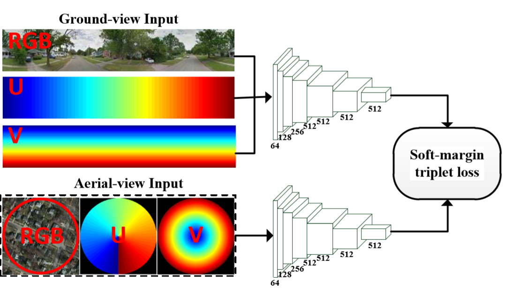
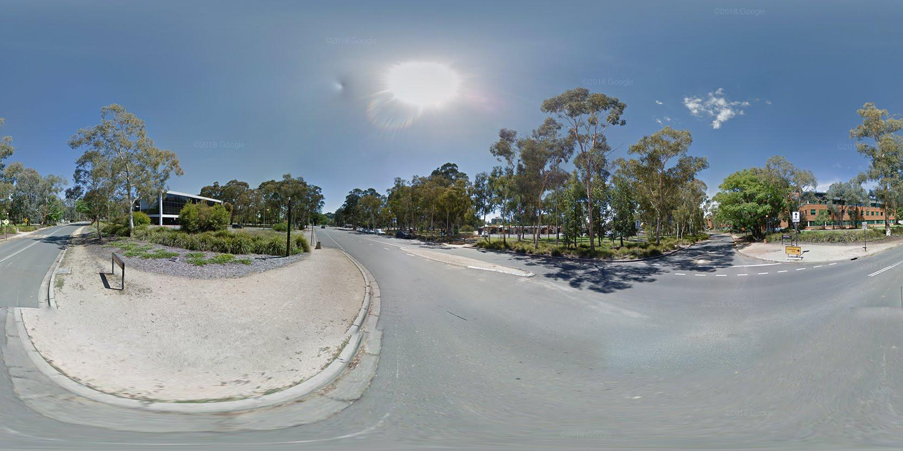
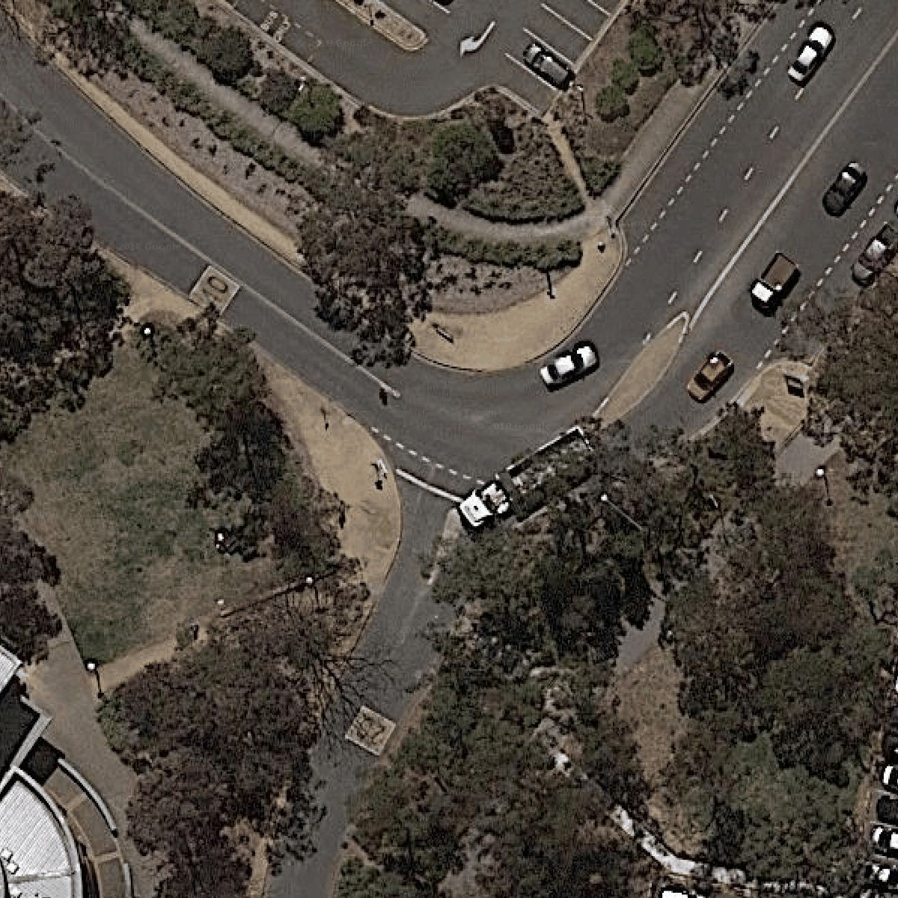

# Lending Orientation to Neural Networks for Cross-view Geo-localization

This contains the ACT dataset and codes for training cross-view geo-localization method described in: Lending Orientation to Neural Networks for Cross-view Geo-localization, CVPR2019. 



# Abstract
This paper studies image-based geo-localization (IBL) problem using ground-to-aerial cross-view matching. The goal is to predict the spatial location of a ground-level query image by matching it to a large geotagged aerial image database (e.g., satellite imagery). This is a challenging task due to the drastic differences in their viewpoints and visual appearances. Existing deep learning methods for this problem have been focused on maximizing feature similarity between spatially closeby image pairs, while minimizing other images pairs which are far apart. They do so by deep feature embedding based on visual appearance in those ground-and-aerial images. However, in everyday life, humans commonly use orientation information as an important cue for the task of spatial localization. Inspired by this insight, this paper proposes a novel method which endows deep neural networks with the commonsense of orientation. Given a ground-level spherical panoramic image as query input (and a large geo-referenced satellite image database), we design a Siamese network which explicitly encodes the orientation (i.e., spherical directions) of each pixel of the images. Our method significantly boosts the discriminative power of the learned deep features, leading to a much higher recall and precision outperforming all previous methods. Our network is also more compact using only 1/5th number of parameters than a previously best-performing network. To evaluate the generalization of our method, we also created a large-scale cross-view localization benchmark containing 100K geotagged ground-aerial pairs covering a geographic area of 300 square miles.

# Codes and Models

## Overview
Our model is implemented in Tensorflow 1.4.0. Other tensorflow versions should be OK.
All our models are trained from scratch, so please run the training codes to obtain models.

Specifically:

train_CVUSA.py is used to train model for CVUSA dataset.
train_CVACT.py is used to train model for CVACT dataset.

The model will be saved after each epoch in directory /src/Models/. The accuracy on test set is computed after each epoch and is saved in directory /src/Result/.

For pre-trained model on CVUSA dataset, please download [CVUSA_model](https://drive.google.com/file/d/1_kkBw1oIHbmsikTL9VJJTL_WLMD_B_R5/view?usp=sharing)

For pre-trained model on CVACT dataset, please download [CVACT_model](https://drive.google.com/file/d/14Yd0-ICAaABQQlWaGjSkDsH8L3YUuML0/view?usp=sharing)

In the above [CVUSA_model](https://drive.google.com/file/d/1_kkBw1oIHbmsikTL9VJJTL_WLMD_B_R5/view?usp=sharing) and [CVACT_model](https://drive.google.com/file/d/14Yd0-ICAaABQQlWaGjSkDsH8L3YUuML0/view?usp=sharing),
we also include the pre-extracted feature embeddings, in case you want to directly use them.

Some may want to know how the training preformance improves along with epoches, please refer to 
[recalls_epoches_CVUSA](https://drive.google.com/file/d/15KN_N8Dc1FzRthDyW_1eeiAXWrGchzNv/view?usp=sharing) and [recalls_epoches_CVACT](https://drive.google.com/file/d/1l1pfw9PSkswk1phVWyHed_31FoG0ZsQM/view?usp=sharing).  


## Codes for [CVUSA dataset](https://github.com/viibridges/crossnet)

If you want to use [CVUSA dataset](https://github.com/viibridges/crossnet), first download it, and then modify the img_root variable in input_data_rgb_ori_m1_1_augument.py (line 12)

For example:

```diff
+ img_root = '..../..../CVUSA/'
```


# ACT dataset
Our ACT dataset is targgeted for fine-grain and city-scale cross-view localization. The ground-view images are panoramas, and satellite images are downloaded from Google map. 
ACT dataset densely cover the Canberra city, and a sample cross-view pair is depicted as below.





Our ACT dataset has three subsets:

1. [ACT-small](https://pages.github.com/). Small-scale dataset for training and validation.
Note the number of training and validation cross-view image pairs are extractly the same as the [CVUSA dataset](https://github.com/viibridges/crossnet) 

2. [ACT-test](https://pages.github.com/). large-scale dataset for testing.
Note the number of testing cross-view image pairs are 10x bigger than [CVUSA dataset](https://github.com/viibridges/crossnet)

Note the Recall@N metric for ACT dataset is slightly different from that used in [CVUSA dataset](https://github.com/viibridges/crossnet). Since CVUSA dataset structures 


